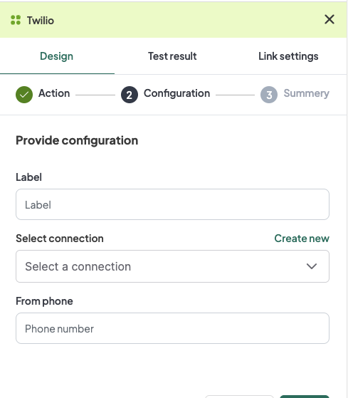
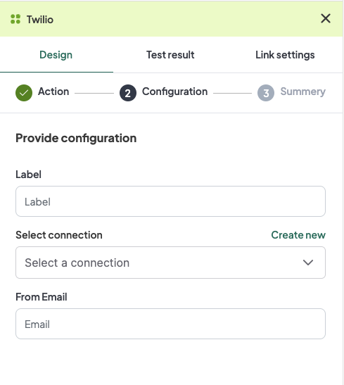

## Introduction
The WeHub Dashboard offers a variety of plugins to enhance and automate your workflows. These plugins are categorized into three types: Triggers, Processors, and Apps. This documentation provides an overview of the "Twilio" plugin, which falls under the Apps category.

## Twilio Plugin
The "Twilio" plugin is used to handle messaging and email services within your workflow. This plugin provides two actions: Twilio and Send Grid. Each action has specific configuration requirements.

### Actions

#### 1. Twilio
The action to handle messaging services via Twilio.

#### Configuration

1. **Label**: A descriptive label to identify this action within your workflow.
2. **Connection**: Select an existing connection to your Twilio account or create a new connection.
3. **From Phone**: Input the phone number from which the message will be sent.

#### Configuration Steps
1. **Label**: Provide a meaningful label for this action. For example, "Send SMS via Twilio".
2. **Connection**: 
   - Select an existing Twilio connection from the dropdown menu.
   - If no connection exists, click on "Create new connection" and follow the prompts to establish a new connection.
3. **From Phone**: Input the phone number from which the message will be sent.

### Example Configuration
#### Configuration Fields:
- **Label**: Send SMS via Twilio
- **Connection**: TwilioConnection1
- **From Phone**: +1234567890

### Example Usage
Let's consider a scenario where you want to configure the Twilio action to send an SMS from a specific phone number.

#### Configuration Input:
1. **Label**: Send SMS via Twilio
2. **Connection**: Select your authorized Twilio connection.
3. **From Phone**: +1234567890

### 2. Send Grid
The action to handle email services via Send Grid.

#### Configuration

1. **Label**: A descriptive label to identify this action within your workflow.
2. **Connection**: Select an existing connection to your Send Grid account or create a new connection.
3. **From Email**: Input the email address from which the email will be sent.

#### Configuration Steps
1. **Label**: Provide a meaningful label for this action. For example, "Send Email via Send Grid".
2. **Connection**: 
   - Select an existing Send Grid connection from the dropdown menu.
   - If no connection exists, click on "Create new connection" and follow the prompts to establish a new connection.
3. **From Email**: Input the email address from which the email will be sent.

### Example Configuration
#### Configuration Fields:
- **Label**: Send Email via Send Grid
- **Connection**: SendGridConnection1
- **From Email**: example@example.com

### Example Usage
Let's consider a scenario where you want to configure the Send Grid action to send an email from a specific email address.

#### Configuration Input:
1. **Label**: Send Email via Send Grid
2. **Connection**: Select your authorized Send Grid connection.
3. **From Email**: example@example.com

### Conclusion
The Twilio plugin in the WeHub Dashboard is a versatile tool for managing messaging and email services within your workflows. By configuring the label, connection, and sender information, you can efficiently handle communications in various scenarios. Ensure to test and validate your configurations to achieve the desired workflow behavior.

If you have any further questions or need additional assistance, please refer to the WeHub Dashboard support documentation or contact our support team.
