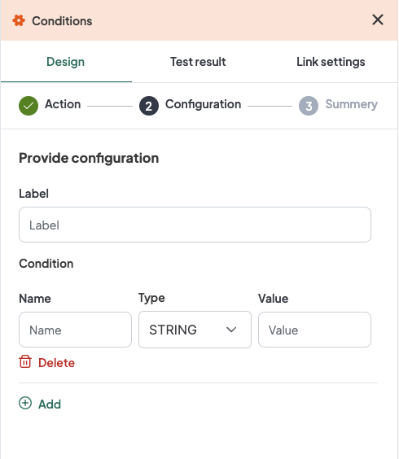

## Introduction
The WeHub Dashboard offers a variety of plugins to enhance and automate your workflows. These plugins are categorized into three types: Triggers, Processors, and Apps. This documentation provides an overview of the "Condition" plugin, which falls under the Processors category.

## Condition Plugin
The "Condition" plugin is used to create simple conditions within your workflow. This can be useful for controlling the flow of data based on specific criteria, enabling more complex and conditional workflows.

### Action
The "Condition" plugin has one primary action: **Create simple Condition**. This action allows you to define and evaluate conditions based on specified criteria.

### Configuration
When configuring the "Create simple Condition" action, you need to provide the following inputs:

1. **Label**: A descriptive label to identify this condition within your workflow.
2. **Name**: The name of the condition.
3. **Type**: The type of the condition's value. Available types are:
   - `STRING`
   - `INTEGER32`
   - `INTEGER64`
   - `FLOAT32`
   - `FLOAT64`
   - `BOOL`
4. **Value**: The value to compare against.

#### Configuration Steps
1. **Label**: Provide a meaningful label for this condition. For example, "Check Order Amount".
2. **Name**: Input a name for the condition. For example, "OrderAmountCondition".
3. **Type**: Select the appropriate type for the condition's value from the dropdown menu. Available types include `STRING`, `INTEGER32`, `INTEGER64`, `FLOAT32`, `FLOAT64`, and `BOOL`.
4. **Value**: Input the value that will be used in the condition. This could be a specific number, string, or boolean value, depending on the selected type.

### Example Configuration
#### Configuration Fields:
- **Label**: Check Order Amount
- **Name**: OrderAmountCondition
- **Type**: INTEGER32
- **Value**: 100

### Example Usage
Let's consider a scenario where you want to create a condition to check if an order amount exceeds a certain threshold.

#### Configuration Input:
1. **Label**: Check Order Amount
2. **Name**: OrderAmountCondition
3. **Type**: INTEGER32
4. **Value**: 100

In your workflow, you can insert the "Condition" plugin to evaluate this condition. If the order amount is greater than the specified value (100 in this case), the workflow can proceed along one path; otherwise, it can take an alternative path.

### Workflow Integration
Here is how you might integrate the "Condition" plugin into a workflow:

1. **Data Input**: The workflow starts by receiving order data.
2. **Condition Check**: The "Condition" plugin checks if the order amount exceeds the specified threshold.
   - If the condition is met (order amount > 100), the workflow proceeds to the next step, such as approving the order.
   - If the condition is not met, the workflow might branch to a different process, such as flagging the order for manual review.
3. **Action Based on Condition**: Depending on the result of the condition check, different actions are taken within the workflow.

### Conclusion
The "Condition" plugin in the WeHub Dashboard is a powerful tool for creating conditional logic within your workflows. By configuring the label, name, type, and value, you can define specific criteria to control the flow of data and actions in your workflows. Ensure to test and validate your conditions to achieve the desired workflow behavior.

If you have any further questions or need additional assistance, please refer to the WeHub Dashboard support documentation or contact our support team.
