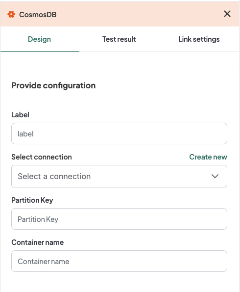
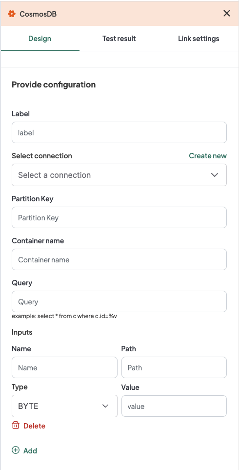

## Introduction
The WeHub Dashboard offers a variety of plugins to enhance and automate your workflows. These plugins are categorized into three types: Triggers, Processors, and Apps. This documentation provides an overview of the "CosmosDB" plugin, which falls under the Processors category.

## CosmosDB Plugin
The "CosmosDB" plugin is used to interact with CosmosDB within your workflow. This plugin provides four actions: Delete database, Get database, Insert database, and Query database. Each action has specific configuration requirements.

### Actions

#### 1. Delete database
Delete a database in CosmosDB.

#### 2. Get database
Retrieve a database from CosmosDB.

#### 3. Insert database
Insert data into a CosmosDB database.

### Configuration for Delete Database, Get Database, and Insert Database
When configuring any of these actions, you need to provide the following inputs:

1. **Label**: A descriptive label to identify this action within your workflow.
2. **Connection**: Select an existing connection to your CosmosDB server or create a new connection.
3. **Partition Key**: Input the partition key.
4. **Container Name**: Input the container name.

#### Configuration Steps for Delete Database, Get Database, and Insert Database

1. **Label**: Provide a meaningful label for this action. For example, "Insert Data into CosmosDB".
2. **Connection**: 
   - Select an existing CosmosDB connection from the dropdown menu.
   - If no connection exists, click on "Create new connection" and follow the prompts to establish a new connection.
3. **Partition Key**: Input the partition key.
4. **Container Name**: Input the container name.

### Example Configuration for Delete Database, Get Database, and Insert Database
#### Configuration Fields:
- **Label**: Insert Data into CosmosDB
- **Connection**: CosmosDBConnection1
- **Partition Key**: /partitionKey
- **Container Name**: myContainer

### Example Usage for Delete Database, Get Database, and Insert Database
Let's consider a scenario where you want to configure the Insert Database action to insert data into a CosmosDB database with a specific connection, partition key, and container name.

#### Configuration Input:
1. **Label**: Insert Data into CosmosDB
2. **Connection**: Select your authorized CosmosDB connection.
3. **Partition Key**: /partitionKey
4. **Container Name**: myContainer

#### 4. Query database
Query data from a CosmosDB database.

### Configuration for Query Database
When configuring the Query Database action, you need to provide the following inputs:

1. **Label**: A descriptive label to identify this action within your workflow.
2. **Connection**: Select an existing connection to your CosmosDB server or create a new connection.
3. **Partition Key**: Input the partition key.
4. **Container Name**: Input the container name.
5. **Query**: Input the query (Example: `select * from c where c.id=%v`).

#### Configuration Steps for Query Database

1. **Label**: Provide a meaningful label for this action. For example, "Query Data from CosmosDB".
2. **Connection**: 
   - Select an existing CosmosDB connection from the dropdown menu.
   - If no connection exists, click on "Create new connection" and follow the prompts to establish a new connection.
3. **Partition Key**: Input the partition key.
4. **Container Name**: Input the container name.
5. **Query**: Input the query (Example: `select * from c where c.id=%v`).

### Example Configuration for Query Database
#### Configuration Fields:
- **Label**: Query Data from CosmosDB
- **Connection**: CosmosDBConnection1
- **Partition Key**: /partitionKey
- **Container Name**: myContainer
- **Query**: select * from c where c.id=%v

### Example Usage for Query Database
Let's consider a scenario where you want to configure the Query Database action to query data from a CosmosDB database with a specific connection, partition key, container name, and query.

#### Configuration Input:
1. **Label**: Query Data from CosmosDB
2. **Connection**: Select your authorized CosmosDB connection.
3. **Partition Key**: /partitionKey
4. **Container Name**: myContainer
5. **Query**: select * from c where c.id=%v

### Additional Configuration for Inputs
If you need to add additional inputs, click on the "Add" button and provide the following configurations:

1. **Name**: Input the name.
2. **Path**: Input the path.
3. **Value**: Input the value.
4. **Type**: Select the type (Types are: INT32, INT64, FLOAT32, DOUBLE, STRING, BYTE, DATE, DATETIME, BOOLEAN, OBJECT, ARRAY, ANY).

### Example Configuration for Additional Inputs
#### Configuration Fields:
- **Name**: userId
- **Path**: /data/userId
- **Value**: 12345
- **Type**: INT32

### Conclusion
The CosmosDB plugin in the WeHub Dashboard is a versatile tool for interacting with CosmosDB within your workflows. By configuring the label, connection, partition key, container name, and query (if applicable), you can efficiently manage data operations in various scenarios. Ensure to test and validate your configurations to achieve the desired workflow behavior.

If you have any further questions or need additional assistance, please refer to the WeHub Dashboard support documentation or contact our support team.
