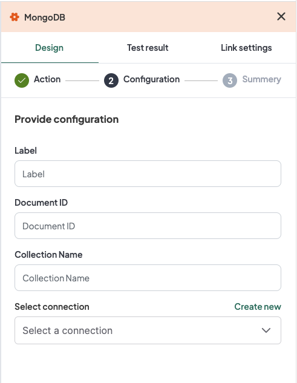
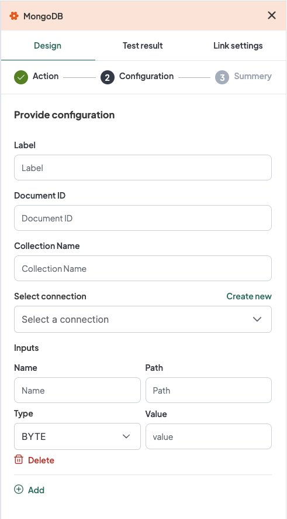

## Introduction
The WeHub Dashboard offers a variety of plugins to enhance and automate your workflows. These plugins are categorized into three types: Triggers, Processors, and Apps. This documentation provides an overview of the "MongoDB" plugin, which falls under the Processors category.

## MongoDB Plugin
The "MongoDB" plugin is used to interact with MongoDB within your workflow. This plugin provides six actions: ADD, GET, PATCH, QUERY, REMOVE, and UPDATE. Each action has specific configuration requirements.

### Actions

#### 1. ADD
Add a document to a MongoDB collection.

#### Configuration for ADD

1. **Label**: A descriptive label to identify this action within your workflow.
2. **Document Id**: Input the document ID.
3. **Collection Name**: Input the collection name.
4. **Connection**: Select an existing connection to your MongoDB server or create a new connection.

In the **Input** section, users need to provide the following configurations:
1. **Name**: Input the name.
2. **Path**: Input the path.
3. **Type**: Select the type (Types are: INT32, INT64, FLOAT32, DOUBLE, STRING, BYTE, DATE, DATETIME, BOOLEAN, OBJECT, ARRAY, ANY).
4. **Value**: Input the value.

#### Configuration Steps for ADD
1. **Label**: Provide a meaningful label for this action. For example, "Add Document to MongoDB".
2. **Document Id**: Input the document ID.
3. **Collection Name**: Input the collection name.
4. **Connection**: 
   - Select an existing MongoDB connection from the dropdown menu.
   - If no connection exists, click on "Create new connection" and follow the prompts to establish a new connection.
5. **Input**: Click on the "Add" button and provide the following configurations for each input:
   - **Name**: Input the name.
   - **Path**: Input the path.
   - **Type**: Select the type.
   - **Value**: Input the value.

### Example Configuration for ADD
#### Configuration Fields:
- **Label**: Add Document to MongoDB
- **Document Id**: 12345
- **Collection Name**: orders
- **Connection**: MongoDBConnection1
- **Input #1**:
   - **Name**: customerName
   - **Path**: /customer/name
   - **Type**: STRING
   - **Value**: John Doe

### Example Usage for ADD
Let's consider a scenario where you want to configure the ADD action to add a document to a MongoDB collection with a specific document ID, collection name, and inputs.

#### Configuration Input:
1. **Label**: Add Document to MongoDB
2. **Document Id**: 12345
3. **Collection Name**: orders
4. **Connection**: Select your authorized MongoDB connection.
5. **Input #1**:
   - **Name**: customerName
   - **Path**: /customer/name
   - **Type**: STRING
   - **Value**: John Doe

#### 2. GET
Retrieve a document from a MongoDB collection.

#### Configuration for GET

1. **Label**: A descriptive label to identify this action within your workflow.
2. **Document Id**: Input the document ID.
3. **Collection Name**: Input the collection name.
4. **Connection**: Select an existing connection to your MongoDB server or create a new connection.

#### Configuration Steps for GET
1. **Label**: Provide a meaningful label for this action. For example, "Get Document from MongoDB".
2. **Document Id**: Input the document ID.
3. **Collection Name**: Input the collection name.
4. **Connection**: 
   - Select an existing MongoDB connection from the dropdown menu.
   - If no connection exists, click on "Create new connection" and follow the prompts to establish a new connection.

### Example Configuration for GET
#### Configuration Fields:
- **Label**: Get Document from MongoDB
- **Document Id**: 12345
- **Collection Name**: orders
- **Connection**: MongoDBConnection1

### Example Usage for GET
Let's consider a scenario where you want to configure the GET action to retrieve a document from a MongoDB collection with a specific document ID and collection name.

#### Configuration Input:
1. **Label**: Get Document from MongoDB
2. **Document Id**: 12345
3. **Collection Name**: orders
4. **Connection**: Select your authorized MongoDB connection.

#### 3. PATCH
Update specific fields in a document in a MongoDB collection.

#### Configuration for PATCH

1. **Label**: A descriptive label to identify this action within your workflow.
2. **Document Id**: Input the document ID.
3. **Collection Name**: Input the collection name.
4. **Connection**: Select an existing connection to your MongoDB server or create a new connection.

In the **Input** section, users need to provide the following configurations:
1. **Name**: Input the name.
2. **Path**: Input the path.
3. **Type**: Select the type.
4. **Value**: Input the value.

#### Configuration Steps for PATCH
1. **Label**: Provide a meaningful label for this action. For example, "Patch Document in MongoDB".
2. **Document Id**: Input the document ID.
3. **Collection Name**: Input the collection name.
4. **Connection**: 
   - Select an existing MongoDB connection from the dropdown menu.
   - If no connection exists, click on "Create new connection" and follow the prompts to establish a new connection.
5. **Input**: Click on the "Add" button and provide the following configurations for each input:
   - **Name**: Input the name.
   - **Path**: Input the path.
   - **Type**: Select the type.
   - **Value**: Input the value.

### Example Configuration for PATCH
#### Configuration Fields:
- **Label**: Patch Document in MongoDB
- **Document Id**: 12345
- **Collection Name**: orders
- **Connection**: MongoDBConnection1
- **Input #1**:
   - **Name**: customerName
   - **Path**: /customer/name
   - **Type**: STRING
   - **Value**: John Smith

### Example Usage for PATCH
Let's consider a scenario where you want to configure the PATCH action to update specific fields in a document in a MongoDB collection with a specific document ID, collection name, and inputs.

#### Configuration Input:
1. **Label**: Patch Document in MongoDB
2. **Document Id**: 12345
3. **Collection Name**: orders
4. **Connection**: Select your authorized MongoDB connection.
5. **Input #1**:
   - **Name**: customerName
   - **Path**: /customer/name
   - **Type**: STRING
   - **Value**: John Smith

#### 4. QUERY
Query documents in a MongoDB collection.

#### Configuration for QUERY

1. **Label**: A descriptive label to identify this action within your workflow.
2. **Document Id**: Input the document ID.
3. **Collection Name**: Input the collection name.
4. **Connection**: Select an existing connection to your MongoDB server or create a new connection.

In the **Input** section, users need to provide the following configurations:
1. **Name**: Input the name.
2. **Path**: Input the path.
3. **Type**: Select the type.
4. **Value**: Input the value.

#### Configuration Steps for QUERY
1. **Label**: Provide a meaningful label for this action. For example, "Query Documents in MongoDB".
2. **Document Id**: Input the document ID.
3. **Collection Name**: Input the collection name.
4. **Connection**: 
   - Select an existing MongoDB connection from the dropdown menu.
   - If no connection exists, click on "Create new connection" and follow the prompts to establish a new connection.
5. **Input**: Click on the "Add" button and provide the following configurations for each input:
   - **Name**: Input the name.
   - **Path**: Input the path.
   - **Type**: Select the type.
   - **Value**: Input the value.

### Example Configuration for QUERY
#### Configuration Fields:
- **Label**: Query Documents in MongoDB
- **Document Id**: 12345
- **Collection Name**: orders
- **Connection**: MongoDBConnection1
- **Input #1**:
   - **Name**: customerName
   - **Path**: /customer/name
   - **Type**: STRING
   - **Value**: John Doe

### Example Usage for QUERY
Let's consider a scenario where you want to configure the QUERY action to query documents in a MongoDB collection with a specific document ID, collection name, and inputs.

#### Configuration Input:
1. **Label**: Query Documents in MongoDB
2. **Document Id**: 12345
3. **Collection Name**: orders
4. **Connection**: Select your authorized MongoDB connection.
5. **Input #1**:
   - **Name**: customerName
   - **Path**: /customer/name
   - **Type**: STRING
   - **Value**: John Doe

#### 5. REMOVE
Remove a document from a MongoDB collection.

#### Configuration for REMOVE

1. **Label**: A descriptive label to identify this action within your workflow.
2. **Document Id**: Input the document ID.
3. **Collection Name**: Input the collection name.
4. **Connection**: Select an existing connection to your MongoDB server or create a new connection.

#### Configuration Steps for REMOVE
1. **Label**: Provide a meaningful label for this action. For example, "Remove Document from MongoDB".
2. **Document Id**: Input the document ID.
3. **Collection Name**: Input the collection name.
4. **Connection**: 
   - Select an existing MongoDB connection from the dropdown menu.
   - If no connection exists, click on "Create new connection" and follow the prompts to establish a new connection.

### Example Configuration for REMOVE
#### Configuration Fields:
- **Label**: Remove Document from MongoDB
- **Document Id**: 12345
- **Collection Name**: orders
- **Connection**: MongoDBConnection1

### Example Usage for REMOVE
Let's consider a scenario where you want to configure the REMOVE action to remove a document from a MongoDB collection with a specific document ID and collection name.

#### Configuration Input:
1. **Label**: Remove Document from MongoDB
2. **Document Id**: 12345
3. **Collection Name**: orders
4. **Connection**: Select your authorized MongoDB connection.

#### 6. UPDATE
Update a document in a MongoDB collection.

#### Configuration for UPDATE

1. **Label**: A descriptive label to identify this action within your workflow.
2. **Document Id**: Input the document ID.
3. **Collection Name**: Input the collection name.
4. **Connection**: Select an existing connection to your MongoDB server or create a new connection.

#### Configuration Steps for UPDATE
1. **Label**: Provide a meaningful label for this action. For example, "Update Document in MongoDB".
2. **Document Id**: Input the document ID.
3. **Collection Name**: Input the collection name.
4. **Connection**: 
   - Select an existing MongoDB connection from the dropdown menu.
   - If no connection exists, click on "Create new connection" and follow the prompts to establish a new connection.

### Example Configuration for UPDATE
#### Configuration Fields:
- **Label**: Update Document in MongoDB
- **Document Id**: 12345
- **Collection Name**: orders
- **Connection**: MongoDBConnection1

### Example Usage for UPDATE
Let's consider a scenario where you want to configure the UPDATE action to update a document in a MongoDB collection with a specific document ID and collection name.

#### Configuration Input:
1. **Label**: Update Document in MongoDB
2. **Document Id**: 12345
3. **Collection Name**: orders
4. **Connection**: Select your authorized MongoDB connection.

### Conclusion
The MongoDB plugin in the WeHub Dashboard is a versatile tool for interacting with MongoDB within your workflows. By configuring the label, document ID, collection name, connection, and inputs, you can efficiently handle various MongoDB operations in different scenarios. Ensure to test and validate your configurations to achieve the desired workflow behavior.

If you have any further questions or need additional assistance, please refer to the WeHub Dashboard support documentation or contact our support team.
