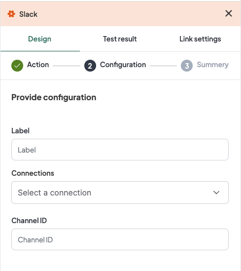

[[_TOC_]]

# Introduction
[Slack](https://slack.com/) plugin allows you to automate interactions with your Slack workspace. This documentation covers the configuration and usage of the `POST_MESSAGE` action, enabling you to post messages to specific Slack channels.

# Post Message Action
The `POST_MESSAGE` action allows you to send messages to a specified Slack channel. This is useful for automating notifications, updates, and communication within your team.

## Configuration
When selecting the `POST_MESSAGE` action, you need to provide the following configurations directly within the _**WeHub**_ Dashboard:

### Label
Input a label for this action to identify it within your workflows.
### Connections
Select an existing connection to your Slack workspace or create a new connection.
### Channel ID
Input the ID of the Slack channel where the message will be posted.

## Configuration Steps

### 1- Label:
Provide a descriptive label for this action. For example, "Daily Standup Reminder".

### 2- Connections:
Select an existing Slack connection from the dropdown menu.
If no connection exists, click on "Select a connection" and follow the prompts to authorize _**WeHub**_ with your Slack workspace.

### 3- Channel ID:
Input the ID of the Slack channel where you want the message to be posted.
To find the Channel ID, right-click on the channel name in Slack, select "Copy link", and extract the Channel ID from the URL `(https://slack.com/app_redirect?channel=<Channel ID>)`.

## Example Configuration
In the configuration interface, fill in the fields as follows:

### 1- Label
Type `Daily Standup Reminder`.

### 2- Connections
Select `SlackConnection1` from the dropdown.

### 3- Channel ID
Type `C1234567890`.

## Example Scenario

## Scenario
You want to set up an automated message to be posted in your team’s Slack channel every morning as a standup reminder.

### Configuration Input
- **_Label:_** Daily Standup Reminder
- **_Connections:_** Select your authorized Slack connection.
- **_Channel ID:_** C1234567890

After configuring, you can define the content of the message within the **_WeHub_** interface. The platform will handle sending the message based on the configuration you've provided.

# Conclusion
The Slack plugin's `POST_MESSAGE` action is a powerful tool for automating communication within your Slack workspace. By configuring the label, connection, and channel ID within the WeHub Dashboard, you can easily set up automated messages to keep your team informed and engaged. Ensure to keep your configurations up-to-date and secure, especially when handling sensitive connection information.

If you have any further questions or need additional assistance, please refer to the mywehub.io support documentation or contact our support team.

