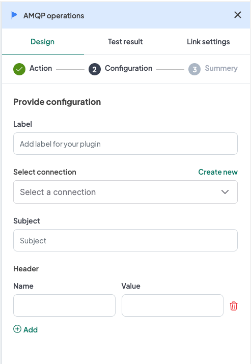
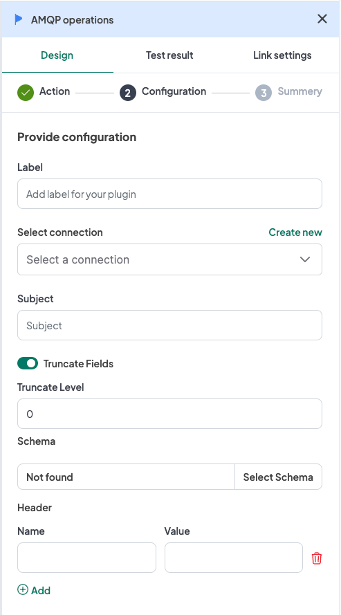
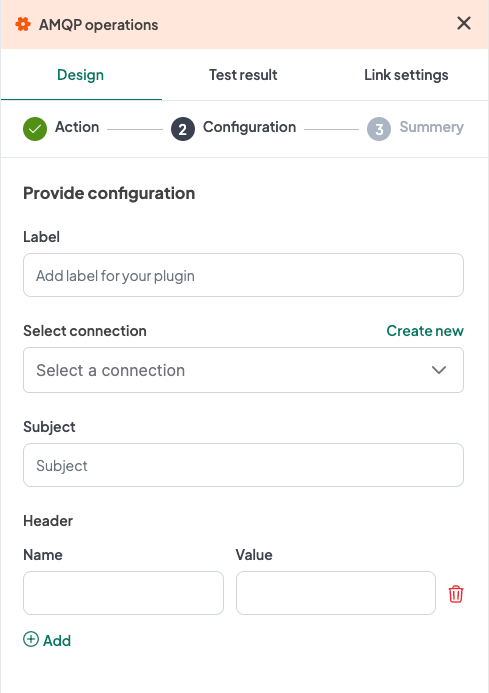
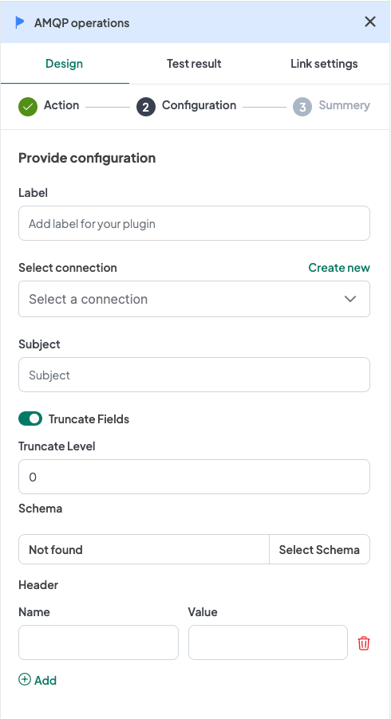

## Introduction
The WeHub Dashboard offers a variety of plugins to enhance and automate your workflows. These plugins are categorized into three types: Triggers, Processors, and Apps. This documentation provides an overview of the "AMQP Operations" plugin, which falls under the Triggers category.

## AMQP Operations Plugin
The "AMQP Operations" plugin is used to handle AMQP 1.0 messaging within your workflow. This plugin provides four actions: AMQP Trigger, AMQP Trigger (TFS), AMQP Client, and AMQP Process Raw Data. Each action has specific configuration requirements.

### Actions

#### 1. AMQP Trigger
The plugin allows you to receive messages from AMQP 1.0. It triggers the workflow.

#### Configuration

1. **Label**: A descriptive label to identify this action within your workflow.
2. **Connection**: Select an existing connection to your AMQP server or create a new connection.
3. **Subject**: Input the subject to listen for messages.
4. **Header** (optional): If a header is added, you need to provide the following inputs for each header:
   - **Name**: Input the name of the header.
   - **Value**: Input the value of the header.

#### Configuration Steps
1. **Label**: Provide a meaningful label for this action. For example, "Receive AMQP Messages".
2. **Connection**: 
   - Select an existing AMQP connection from the dropdown menu.
   - If no connection exists, click on "Create new connection" and follow the prompts to establish a new connection.
3. **Subject**: Input the subject to listen for messages.
4. **Header**: (if applicable):
   - **Name**: Provide the name of the header.
   - **Value**: Provide the value of the header.

### Example Configuration
#### Configuration Fields:
- **Label**: Receive AMQP Messages
- **Connection**: AMQPConnection1
- **Subject**: my-subject
- **Header**:
   - **Name**: Content-Type
   - **Value**: application/json

### Example Usage
Let's consider a scenario where you want to configure the AMQP Trigger action to start a workflow when a message is received on a specific subject.

#### Configuration Input:
1. **Label**: Receive AMQP Messages
2. **Connection**: Select your authorized AMQP connection.
3. **Subject**: my-subject
4. **Header** (if applicable):
   - **Name**: Content-Type
   - **Value**: application/json

### 2. AMQP Trigger (TFS)
The plugin allows you to receive messages from AMQP 1.0. It triggers the workflow (Transformation Fields format).

#### Configuration

1. **Label**: A descriptive label to identify this action within your workflow.
2. **Connection**: Select an existing connection to your AMQP server or create a new connection.
3. **Subject**: Input the subject to listen for messages.
4. **Schema**: Select the schema for the transformation.
5. **Truncate Fields** (optional): If the "Truncate Fields" toggle button is turned on, provide the following input:
   - **Truncate Level**: Input the truncate level.
6. **Header** (optional): If a header is added, you need to provide the following inputs for each header:
   - **Name**: Input the name of the header.
   - **Value**: Input the value of the header.

#### Configuration Steps
1. **Label**: Provide a meaningful label for this action. For example, "Receive AMQP Messages TFS".
2. **Connection**: 
   - Select an existing AMQP connection from the dropdown menu.
   - If no connection exists, click on "Create new connection" and follow the prompts to establish a new connection.
3. **Subject**: Input the subject to listen for messages.
4. **Schema**: Select the schema for the transformation.
5. **Truncate Fields**: (if applicable):
   - **Truncate Level**: Input the truncate level.
6. **Header**: (if applicable):
   - **Name**: Provide the name of the header.
   - **Value**: Provide the value of the header.

### Example Configuration
#### Configuration Fields:
- **Label**: Receive AMQP Messages TFS
- **Connection**: AMQPConnection1
- **Subject**: my-subject
- **Schema**: MySchema
- **Truncate Fields**:
   - **Truncate Level**: 100
- **Header**:
   - **Name**: Content-Type
   - **Value**: application/json

### Example Usage
Let's consider a scenario where you want to configure the AMQP Trigger (TFS) action to start a workflow when a message is received on a specific subject, with transformation fields and optional truncation.

#### Configuration Input:
1. **Label**: Receive AMQP Messages TFS
2. **Connection**: Select your authorized AMQP connection.
3. **Subject**: my-subject
4. **Schema**: MySchema
5. **Truncate Fields**:
   - **Truncate Level**: 100
6. **Header** (if applicable):
   - **Name**: Content-Type
   - **Value**: application/json

### 3. AMQP Client
The plugin allows you to send messages to AMQP 1.0.

#### Configuration
The configuration for this action is exactly like the AMQP Trigger action.

1. **Label**: A descriptive label to identify this action within your workflow.
2. **Connection**: Select an existing connection to your AMQP server or create a new connection.
3. **Subject**: Input the subject to send messages to.
4. **Header** (optional): If a header is added, you need to provide the following inputs for each header:
   - **Name**: Input the name of the header.
   - **Value**: Input the value of the header.

### 4. AMQP Process Raw Data
The plugin allows you to send messages to AMQP 1.0.

#### Configuration
The configuration for this action is exactly like the AMQP Trigger (TFS) action.

1. **Label**: A descriptive label to identify this action within your workflow.
2. **Connection**: Select an existing connection to your AMQP server or create a new connection.
3. **Subject**: Input the subject to send messages to.
4. **Schema**: Select the schema for the transformation.
5. **Truncate Fields** (optional): If the "Truncate Fields" toggle button is turned on, provide the following input:
   - **Truncate Level**: Input the truncate level.
6. **Header** (optional): If a header is added, you need to provide the following inputs for each header:
   - **Name**: Input the name of the header.
   - **Value**: Input the value of the header.

### Conclusion
The AMQP Operations plugin in the WeHub Dashboard is a versatile tool for managing AMQP 1.0 messaging within your workflows. By configuring the label, connection, subject, and optional headers, you can efficiently handle AMQP communications in various scenarios. Ensure to test and validate your configurations to achieve the desired workflow behavior.

If you have any further questions or need additional assistance, please refer to the WeHub Dashboard support documentation or contact our support team.
