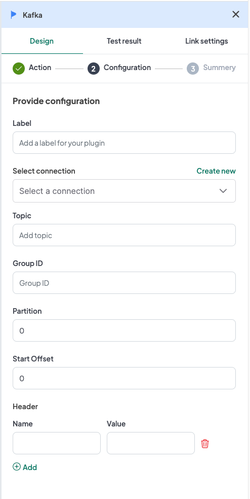

## Introduction
The WeHub Dashboard offers a variety of plugins to enhance and automate your workflows. These plugins are categorized into three types: Triggers, Processors, and Apps. This documentation provides an overview of the "Kafka" plugin, which falls under the Triggers category.

## Kafka Plugin
The "Kafka" plugin is used to handle Kafka messaging within your workflow. This plugin provides two actions: Kafka Subscribe and Kafka Publish. Each action has the same configuration requirements.

### Actions
1. **Kafka Subscribe**: Used to start a workflow when a message is received on a specified Kafka topic.
2. **Kafka Publish**: Used to publish a message to a specified Kafka topic as part of a workflow.

### Configuration
When configuring either of the Kafka actions, you need to provide the following inputs:

1. **Label**: A descriptive label to identify this action within your workflow.
2. **Connection**: Select an existing connection to your Kafka server or create a new connection.
3. **Topic**: Input the name of the Kafka topic.
4. **Group Id**: Input the group ID for the Kafka consumer group.
5. **Partition**: Input the partition number.
6. **Start Offset**: Input the start offset for message consumption.

Additionally, you can add a **header** configuration. If a header is added, you need to provide the following inputs for each header:

1. **Name**: Input the name of the header.
2. **Value**: Input the value of the header.

#### Configuration Steps
1. **Label**: Provide a meaningful label for this action. For example, "Order Messages Subscription".
2. **Connection**: 
   - Select an existing Kafka connection from the dropdown menu.
   - If no connection exists, click on "Create new connection" and follow the prompts to establish a new connection.
3. **Topic**: Input the name of the Kafka topic you want to subscribe to or publish messages to.
4. **Group Id**: Input the group ID for the Kafka consumer group.
5. **Partition**: Specify the partition number.
6. **Start Offset**: Specify the start offset for message consumption.

If you choose to add headers, input the following for each header:
1. **Name**: Provide the name of the header.
2. **Value**: Provide the value of the header.

### Example Configuration
#### Configuration Fields:
- **Label**: Order Messages Subscription
- **Connection**: KafkaConnection1
- **Topic**: orders
- **Group Id**: order-group
- **Partition**: 0
- **Start Offset**: latest

#### Header Configuration (Optional):
- **Name**: Content-Type
- **Value**: application/json

### Example Usage
Let's consider a scenario where you want to configure the Kafka Subscribe action to start a workflow when a message is received on the "orders" topic.

#### Configuration Input:
1. **Label**: Order Messages Subscription
2. **Connection**: Select your authorized Kafka connection.
3. **Topic**: orders
4. **Group Id**: order-group
5. **Partition**: 0
6. **Start Offset**: latest

#### Header Configuration (if applicable):
1. **Name**: Content-Type
2. **Value**: application/json

In your workflow, you can insert the Kafka Subscribe action to initiate the workflow when a message is received on the specified topic.

### Workflow Integration
Here is how you might integrate the Kafka plugin into a workflow:

1. **Kafka Subscribe**: The workflow starts with the Kafka Subscribe action that activates upon receiving a message on the specified topic.
2. **Data Processing**: The workflow proceeds to process the received Kafka message data.
3. **Kafka Publish**: The workflow sends a message to a Kafka topic using the Kafka Publish action if needed.

### Conclusion
The Kafka plugin in the WeHub Dashboard is a versatile tool for managing Kafka messaging within your workflows. By configuring the label, connection, topic, group ID, partition, and start offset, you can efficiently handle Kafka communications in various scenarios. Ensure to test and validate your configurations to achieve the desired workflow behavior.

If you have any further questions or need additional assistance, please refer to the WeHub Dashboard support documentation or contact our support team.
