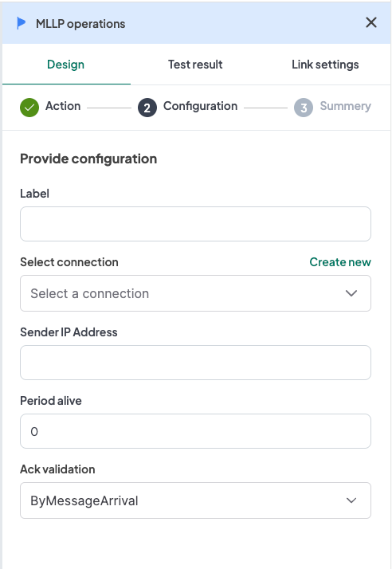

## Introduction
The WeHub Dashboard offers a variety of plugins to enhance and automate your workflows. These plugins are categorized into three types: Triggers, Processors, and Apps. This documentation provides an overview of the "MLLP Operations" plugin, which falls under the Triggers category.

## MLLP Operations Plugin
The "MLLP Operations" plugin is used to handle MLLP (Minimal Lower Layer Protocol) messages within your workflow. This plugin provides three actions: Trigger, Client, and Response. Each action has the same configuration requirements.

### Actions
1. **Trigger**: Used to start a workflow when an MLLP message is received.
2. **Client**: Used to send an MLLP message as part of a workflow.
3. **Response**: Used to handle responses for MLLP messages within a workflow.

### Configuration
When configuring any of the MLLP Operations actions, you need to provide the following inputs:

1. **Label**: A descriptive label to identify this action within your workflow.
2. **Connection**: Select an existing connection to your MLLP server or create a new connection.
3. **Sender IP Address**: Input the IP address of the sender.
4. **Period Alive**: Input the period (in seconds) for which the connection should stay alive.
5. **Ack Validation**: Select the acknowledgment validation method. Available options are:
   - **By message arrival**
   - **By workflow success**

#### Configuration Steps
1. **Label**: Provide a meaningful label for this action. For example, "Receive HL7 Messages".
2. **Connection**: 
   - Select an existing MLLP connection from the dropdown menu.
   - If no connection exists, click on "Create new connection" and follow the prompts to establish a new connection.
3. **Sender IP Address**: Input the IP address of the sender of the MLLP messages.
4. **Period Alive**: Specify the duration (in seconds) for which the connection should remain active.
5. **Ack Validation**: Select the method for acknowledgment validation from the dropdown menu.

### Example Configuration
#### Configuration Fields:
- **Label**: Receive HL7 Messages
- **Connection**: MLLPConnection1
- **Sender IP Address**: 192.168.1.1
- **Period Alive**: 300
- **Ack Validation**: By message arrival

### Example Usage
Let's consider a scenario where you want to configure the MLLP Trigger action to start a workflow when an HL7 message is received.

#### Configuration Input:
1. **Label**: Receive HL7 Messages
2. **Connection**: Select your authorized MLLP connection.
3. **Sender IP Address**: 192.168.1.1
4. **Period Alive**: 300
5. **Ack Validation**: By message arrival

In your workflow, you can insert the MLLP Trigger action to initiate the workflow when an HL7 message is received from the specified sender.

### Workflow Integration
Here is how you might integrate the MLLP Operations plugin into a workflow:

1. **MLLP Trigger**: The workflow starts with the MLLP Trigger that activates upon receiving an HL7 message from the specified sender.
2. **Data Processing**: The workflow proceeds to process the HL7 message data.
3. **MLLP Client**: The workflow sends a response or additional messages using the MLLP Client action if needed.
4. **MLLP Response**: The workflow handles responses using the MLLP Response action to ensure proper acknowledgment and processing.

### Conclusion
The MLLP Operations plugin in the WeHub Dashboard is a versatile tool for managing MLLP messages within your workflows. By configuring the label, connection, sender IP address, period alive, and acknowledgment validation, you can efficiently handle MLLP communications in various scenarios. Ensure to test and validate your configurations to achieve the desired workflow behavior.

If you have any further questions or need additional assistance, please refer to the WeHub Dashboard support documentation or contact our support team.
